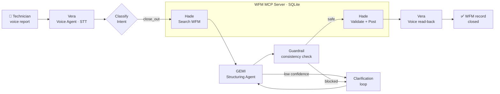

<div align="center">

# 🔧 Field Ops Orchestrator — Team ZO

**Speak a job report. Get a structured, validated work-order close-out.**

A voice-driven, multi-agent system that turns a water-utility technician's spoken
field report into a fully structured WFM (Work Force Management) record — transcribed,
classified, coded, guardrailed, and posted back to the system, end to end.

[](https://www.python.org/)
[](https://github.com/langchain-ai/langgraph)
[](https://wandb.ai/)
[](https://github.com/openai/whisper)
[](#-license)

*Built at the AGI House Hackathon · May 31, 2026*

</div>

---

## 📖 Table of Contents

- [The Problem](#-the-problem)
- [The Solution](#-the-solution)
- [Architecture](#-architecture)
- [The Agents](#-the-agents)
- [PCRM Coding](#-pcrm-coding)
- [Tech Stack](#-tech-stack)
- [Project Structure](#-project-structure)
- [Getting Started](#-getting-started)
- [Usage](#-usage)
- [Evaluation](#-evaluation)
- [Observability](#-observability)
- [License](#-license)

---

## 🎯 The Problem

When a water-maintenance technician finishes a job — repairing a leaking main,
repacking a valve, replacing a blown fitting — they have to *close out* the work
order with a precise set of controlled **PCRM codes** (Problem, Cause, Rectify, Method).

Doing this by hand on a tablet, in the field, in the rain, is slow and error-prone.
The vocabulary is large, the rules are subtle (is a clamp on a main `M_CLA` or `M_LID`?),
and miscoded jobs corrupt the asset-maintenance data that utilities rely on for
planning and compliance.

## 💡 The Solution

The technician simply **talks**:

> *"Finished the job at 14 Smith Street — it was a leaking main tap on the 100mm DICL,
> corrosion, installed a stainless clamp and backfilled."*

The system listens, understands the intent, maps the report to the exact WFM enum codes
with per-field confidence, asks a clarifying question when it's unsure, runs a consistency
guardrail, validates against the schema, and posts the close-out — then reads the result
back aloud for confirmation. Every step is traced in Weave.

---

## 🏗 Architecture

A **LangGraph** state machine coordinates three specialist agents that communicate in an
A2A (agent-to-agent) style. All system-of-record operations go through an **MCP server**
over a local SQLite WFM database.



**Pipeline:** `Vera → (intent) → [search] → GEMI → (clarify ↺) → guardrail → Hade → confirm`

---

## 🤖 The Agents

| Agent | Role | Responsibilities |
|-------|------|------------------|
| 🎤 **Vera** | Voice Agent | Local **Whisper** speech-to-text, microphone capture (record-until-silence), spoken clarifications, and TTS read-back of results. |
| 🧩 **GEMI** | Structuring Agent | The core. Maps messy speech into controlled WFM enum codes (PCRM or new-fault fields) with **per-field confidence** and **clarification signals**. Uses a domain-tuned prompt with disambiguation rules + few-shot examples, and falls back to validated ground-truth lookups for known transcripts. |
| 🛡 **Hade** | HelpDesk Agent | Owns the WFM through **MCP tools**. Searches & resolves request IDs, runs schema + semantic validation, drives a self-correction loop back to GEMI, enforces business rules, and posts close-outs / new faults. |

The orchestrator manages two key loops:
- **Clarification loop** — if any field's confidence is too low, Vera asks the technician a targeted follow-up (up to 2 rounds).
- **Correction loop** — Hade re-checks GEMI's codes against the enum schema *and* domain semantics, sending feedback for a retry if something is off.

---

## 🔢 PCRM Coding

Close-outs are described by four controlled-vocabulary code families (loaded from
[`data/codes.json`](data/codes.json)):

| Family | Question it answers | Examples |
|--------|--------------------|----------|
| **P**roblem | *What was wrong?* | `P_LKG` Leaking · `P_BKN` Broken · `P_BLK` Blocked |
| **C**ause | *Why did it happen?* | `C_011` Corrosion · `C_WER` Wear & Tear · `C_VDL` Vandalism |
| **R**ectify | *What was done?* | `R_RPR` Repaired · `R_RPL` Replaced · `R_ISO` Isolated |
| **M**ethod | *How was it fixed?* | `M_LID` Resealed/Clamped · `M_002` Installed new · `M_CLA` Clamp |

New-fault reports are instead classified into `req_class`, `priority` (SLA window),
`severity`, and location type — validated against the rules in
[`schema/request_schema.json`](schema/request_schema.json) (e.g. *P1 urgent requires HIGH severity*).

---

## 🧰 Tech Stack

- **Orchestration:** LangGraph state machine + A2A-style messaging
- **LLM:** W&B Inference API (default `OpenPipe/Qwen3-14B-Instruct`) via the OpenAI client
- **Speech:** OpenAI Whisper (local STT) · macOS `say` (TTS fallback) · `sounddevice` / `soundfile`
- **Tooling protocol:** MCP server exposing `search / get / validate / close / post` over SQLite
- **Data:** SQLite WFM database seeded from an Excel export (`openpyxl`)
- **Observability:** Weights & Biases + Weave (full tracing, evaluations, metrics)
- **Interfaces:** CLI · Streamlit web app · Starlette/Uvicorn voice web app

---

## 📂 Project Structure

```
Team-ZO/
├── app.py                  # CLI entry point (interactive / one-shot / --eval)
├── demo.py                 # Live voice demo (record → classify → structure → close)
├── webapp.py               # Streamlit two-way voice web app
├── config.py               # Model + W&B config and inference client
├── agents/
│   ├── voice_agent.py      # Vera  — STT / TTS / mic capture
│   ├── structuring_agent.py# GEMI  — transcript → PCRM codes
│   └── helpdesk_agent.py   # Hade  — validation, correction, WFM posting
├── orchestrator/
│   ├── graph.py            # LangGraph state machine wiring the agents
│   └── intents.py          # Intent classifier (close_out / new_fault / status_check)
├── mcp_servers/
│   └── wfm_server.py       # WFM MCP server over SQLite (search/get/validate/close/post)
├── frontend/
│   └── server.py           # Starlette + Uvicorn continuous-voice web frontend
├── weave_eval/             # Weave evaluation pipeline, scorers, dataset builders
├── schema/
│   └── request_schema.json # Close-out + new-fault schema and business rules
├── data/
│   ├── seed_db.py          # Build SQLite DB + codes.json from the Excel export
│   ├── codes.json          # PCRM controlled vocabulary
│   └── wfm.sqlite          # Seeded WFM database
└── requirements.txt
```

> A second, more general A2A orchestration scaffold lives under [`src/`](src/) (`main.py`),
> exploring generic researcher/analyzer/planner/validator agents. The field-service
> system above is the primary application.

---

## 🚀 Getting Started

### Prerequisites

- Python 3.10+
- A Weights & Biases account + API key (used for both the inference LLM and observability)
- A working microphone (for the live voice demo) and `ffmpeg` (required by Whisper)

### Installation

```bash
git clone git@github.com:OmkumarSolanki/Team-ZO.git
cd Team-ZO

python -m venv venv
source venv/bin/activate        # Windows: venv\Scripts\activate

pip install -r requirements.txt
```

### Configuration

Copy the example environment file and fill in your keys:

```bash
cp .env.example .env
```

```dotenv
WANDB_API_KEY=your_wandb_api_key
WANDB_PROJECT=agi-hackathon
WANDB_ENTITY=your_wandb_entity
OPENAI_API_KEY=your_openai_api_key      # optional
ANTHROPIC_API_KEY=your_anthropic_api_key# optional
```

The default model and W&B inference endpoint are configured in [`config.py`](config.py)
and can be overridden via `STRUCTURING_MODEL` / `JUDGE_MODEL`.

### Seed the database

The SQLite WFM database is built from the bundled Excel export:

```bash
python data/seed_db.py
```

This creates `data/wfm.sqlite`, regenerates `data/codes.json`, and writes the request schema.

---

## 🕹 Usage

### CLI orchestrator

```bash
python app.py                                       # interactive REPL
python app.py "Finished the job at Collaroy, leaking main tap, installed a clamp"
python app.py --eval                                # run the Weave evaluation
```

### Live voice demo

```bash
python demo.py                       # full voice pipeline (mic → close-out)
python demo.py --text "report..."    # text mode, skip the microphone
python demo.py --audio report.wav    # transcribe an audio file
python demo.py --duration 15         # max recording length (seconds)
```

### Streamlit web app

```bash
streamlit run webapp.py
```

### Continuous-voice web frontend

```bash
python frontend/server.py            # Starlette + Uvicorn; dashboard + per-ticket chat
```

> ⚠️ The web interfaces and MCP server are intended for **local development** and ship
> **without authentication**. Add access controls before exposing any of them on a network.

---

## 📊 Evaluation

The system is evaluated against the real `close_out_PCRM` ground truth using the full
`Vera → GEMI → Hade` pipeline, scored with exact-match, Hade-as-judge enum validity, and
GEMI confidence.

```bash
python weave_eval/run_eval.py            # 20 examples
python weave_eval/run_eval.py --limit 50 # 50 examples
python weave_eval/run_eval.py --all      # all ~130 examples
```

Results are printed to the console and pushed to the Weave **Evaluations** dashboard.

---

## 🔭 Observability

Every agent, tool call, intent classification, guardrail, and evaluation is decorated with
`@weave.op()` and logged to Weights & Biases. After any run, inspect full traces at:

```
https://wandb.ai/<WANDB_ENTITY>/<WANDB_PROJECT>/weave
```

Each agent is a named `weave.Model`, so **Vera**, **GEMI**, and **Hade** appear as distinct,
inspectable nodes in every trace.

---

## 📝 License

Released under the [MIT License](#-license).

---

<div align="center">

**Team ZO** · AGI House Hackathon 2026

*Made with LangGraph, Whisper, and Weights & Biases.*

</div>
